# DeepSeek Harness — Graphify Analysis

> **Status:** Prerequisite research for porting `superpowers` skills to the DeepSeek Harness.
> **Audience:** The next agent (coder) who will write the actual port.
> **Generated:** 2026-08-15.
> **Method:** Graphify skill + targeted direct reads. Full Graphify extraction was
> deferred because the corpus is 6 990 files / 4.4 M words; instead, the most
> load-bearing sub-trees (`docs/`, the four `skill/*` packages, `core/`,
> `llm/llm-deepseek/`, `bundle/`, `hooks/`, `preset/agent-presets/`,
> `apps/cli/src/`) were read in full, and the architecture's actual source
> contract extracted by hand. The full Graphify JSON / `GRAPH_REPORT.md` can be
> regenerated later with `graphify /tmp/deepseek-harness-analysis/ --no-viz`
> if a more structured query interface is needed.
>
> **Update 2026-08-15:** A second pass used a **sliding-window iterative
> method** — three depth graphs over the three highest-value sub-systems
> (skill seam, hook subsystem, agent-presets) merged into a single
> cross-seam graph. See [§9 Iterative depth graphs](#9-iterative-depth-graphs).

## 1. Overview

**Repo:** `https://github.com/deepseek-ai/deepseek-harness`
**Tag / release:** none yet — repository first pushed 2026-08-13, version
`0.1.0-rc.5` in `apps/cli/package.json` (CLI bin published as `@deepseek-ai/dsh`).
**Tagline:** "DeepSeek Harness: Everything is a Plugin."
**Description:** Open-source agent harness developed by DeepSeek AI. Powered by
[Cordis](https://github.com/cordiverse/cordis) (vendored under `vendor/`). The
repository README says: "THERE WILL BE COMPATIBILITY-BREAKING CHANGES" — this is
explicitly developer preview.
**License:** MIT (third-party notices in `THIRD_PARTY_NOTICES.md`).
**Stack:** TypeScript / ESM everywhere, Node ≥ 22.19 (or ≥ 24), `pnpm`
workspaces (`pnpm-workspace.yaml`), Vitest for tests, pnpm-lock.yaml present.
Two native addons (`native/landlock-run` for Linux sandboxing, plus a
`@vscode/ripgrep` binary for the shipped `glob`/`grep` tools).
**How to run from npm:** `npx @deepseek-ai/dsh web` (serves on
`http://127.0.0.1:3080`). There is also a `headless` mode
(`@deepseek-ai/dsh-acp-demo` and the example `headless-agent`).
**How to run from source:** `pnpm install && pnpm run build && pnpm dsh web`.

### Why this is the right repo

`gh search repos "harness" --owner=deepseek-ai` returns exactly one hit. The
tagline matches every Chinese-tech-press description of "DeepSeek's first Agent
product" launched 2026-08-13 (the same week this analysis was commissioned).
The `MIT` license and the
[discriminating feature](https://github.com/deepseek-ai/deepseek-harness/blob/main/AGENTS.md)
("everything is a plugin" — model, tools, skills, session, sandbox, storage,
loop, scheduler, UI are all Cordis plugins) make this unambiguously the
"harness" the user means, and not the model weights repos (`DeepSeek-V3`,
`DeepSeek-R1`, `DeepSeek-Coder`), the vision / OCR / MoE training repos, or
the community projects (`Hmbown/DeepSeek-TUI`, `esengine/DeepSeek-Reasonix`,
`unbug/tday`) that wrap OpenAI-CLI / Codex / Claude Code for DeepSeek models
without being the official harness.

### High-level shape

```
deepseek-harness/
├── apps/                      # two shipped apps: CLI + browser UI
│   ├── cli/                   # @deepseek-ai/dsh — the dsh command
│   └── web/                   # the browser surface
├── packages/                  # 50+ Cordis plugin packages (workspace:^)
│   ├── core/                  # product API spine
│   ├── llm/                   # LLM capability: Service Definition + DeepSeek providers
│   ├── skill/                 # skill provider registry + filesystem impl + tool consumer
│   ├── tool-*/                # one shipped tool per package
│   ├── preset/agent-presets/  # per-session agent composition
│   ├── bundle/                # installable profile bundles (base, web-app, headless)
│   ├── hooks/                 # Claude Code / Codex hook protocol bridges
│   ├── session/               # durable session log + projections
│   ├── …
│   └── util/, boot/, host/, identity/, preset/, shell/, settings/, …
├── docs/                      # architecture, catalogs, subsystems, cookbook
├── examples/                  # 5 runnable compositions (acp-agent, headless-agent, …)
├── python/                    # Python SDK + bundled runtime
├── native/landlock-run/       # Linux sandboxing native addon
├── vendor/                    # vendored Cordis source (pinned SHAs)
├── scripts/, website/         # repo gates, generators, VitePress site
├── .agents/                   # internal "skills" + Agent Notes used by the team
├── AGENTS.md                  # the repo's own standing rules (analog to superpowers)
├── CLAUDE.md -> AGENTS.md     # symlink: Claude Code inherits the same rules
└── package.json + pnpm-workspace.yaml
```

## 2. Architecture

The whole thing is a [Cordis](https://github.com/cordiverse/cordis) plugin
tree composed at boot from ordered layers. From `docs/architecture.md`:

> A running `dsh` is a plugin tree composed at boot from ordered layers. A
> **profile** is a named composition stored in the Harness home. It lists the
> bundles it stacks, holds any out-of-tree plugins it installs, and keeps the
> user's own `cordis.patch.yml`. `web` and `headless` ship as templates. A
> **bundle** is a distribution format for Cordis config rows and the code they
> mount, so whatever it inserts stays patchable by the layers above it.

### Profile / Bundle / Patch stack

```
dsh --profile web --patch ./extra.yml
  └─ profile "web"          (named, stored in ~/.dsh, ships as template)
     ├─ bundle dsh-base     (1st: model adapters, tools, persistence, sandbox, …)
     ├─ bundle dsh-web-app  (2nd: webserver, API gateway, browser plugin roster)
     ├─ profile.cordis.patch.yml  (the user's overrides for this profile)
     ├─ ~/.dsh/cordis.patch.yml   (global user overrides)
     └─ ./extra.yml                (per-invocation overlay)
```

A patch targets a row by `id` and **replaces its whole config** (no
deep-merge). Inspect the actual tree with `dsh --profile web --dump-config`.

### Core packages (`ctx.*` keys)

From `docs/architecture.md`'s "Core packages" table:

| Package | Owns | `ctx` key |
|---|---|---|
| `core/session` | Append-only `SessionEvent` log + in-memory store | `ctx.sessions` |
| `core/system-prompt` | Prompt-section + tool-schema assembly | `ctx.systemPrompt` |
| `core/tools` | Scoped tool registry and guarded execution pipeline | `ctx.tools` |
| `core/agent` | The `Agent` interface, live registry, `agent/*` events | `ctx.agents` |
| `core/agent-loop` | The default driver implementing that interface | `ctx.agentLoop` |
| `core/scope` | Per-agent scoped-registration primitive | library, no key |
| `llm/llm` | Message + stream vocabulary, adapter seam | `ctx.llm` |
| `skill/skill` | Skill provider registry (caller-of-providers) | `ctx.skills` |
| `skill/skill-filesystem` | Local-FS provider of `ctx.skills` | (no key — registers into `ctx.skills`) |
| `skill/tool-skill` | Model-facing catalog + `skill` tool | (consumer of `ctx.skills`) |
| `llm/llm-deepseek` | The DeepSeek API adapter for `ctx.llm` | registers route `deepseek-official` |
| `preset/agent-presets` | Per-session agent composition | `ctx.agentPresets` |
| `settings/settings` | User-settings capability seam | `ctx.settings` |
| `credentials/credentials` | Credential-reference capability seam | `ctx.credentials` |

The full list of capability seams and the package that owns each is in
`docs/capability-seams.md` (a Mermaid graph; readable as
"Service Definition / Service Provider / Consumer" for each capability).
Capability seams split roles when roles evolve independently — e.g.
`packages/shell` (Service Definition), `dsh-bash-local` /
`dsh-bash-sandbox` (Providers), `dsh-tool-bash` (Consumer).

### Turn / step lifecycle

The "turn flow" is the same shape Claude Code uses, just named differently.
From `docs/architecture.md`:

```text
turn/start
  claim next-step input plus one queued message
  assemble prompt sections + tool schemas
  -> agent/pre-step (waterfall)              reject | enter(messages)
     reject, or a first enter rewritten empty -> close the turn with no step
     step/start
     append entered messages as user/message
     derive model history from the log
     agent/request -> llm/stream -> assistant/chunk* -> assistant/message
     tool/call* -> tools/pre-execute -> tools/execute -> tools/post-execute -> tool/result*
     step/end
     tools owe another request, or next-step input arrived -> claim -> next step
  -> agent/turn-stopping
turn/end
```

The full Mermaid sequence is `docs/agent-lifecycle.md`. Crucial events the
next agent needs to know:

- `agent/pre-step` (waterfall) — listener decides what the model sees.
  Listeners may rewrite or reject; rejections still close a durable turn.
- `agent/request` (waterfall) + `llm/stream` (waterfall) — listeners intercept
  the actual outbound LLM call.
- `agent/turn-stopping` (serial, no `next()`) — final checkpoint.
- `tools/pre-execute`, `tools/execute`, `tools/post-execute` (waterfalls) —
  the per-tool pipeline. **All three must call `next()` to delegate.**
- `session/event` — durable, replayable. `assistant/chunk`, `assistant/message`,
  `tool/call`, `tool/result`, `user/message`, `turn/*`, `step/*` all live here.
  Any model-visible input MUST reconstruct from the log — this is enforced
  by a runtime invariant.

### Session log is the source of truth

> **Model-visible means logged.** Anything that reaches a model request must be
> reconstructable from the log, and a runtime invariant asserts it. This is
> why a new model-visible input requires a new session event: extend
> `SessionEventMap` and render from the log. — `docs/architecture.md`

This is the same model that Claude Code, Codex, and Gemini CLI use, and it's
the design rule that makes skills safe to add without breaking replay.

## 3. Skill / tool / plugin format

The harness has three separate "extensibility" concepts, and the next agent
must keep them distinct — they look superficially similar but have different
rules:

### 3a. Skills (closest analog to superpowers)

**What it is:** A reusable set of task-specific instructions. Loaded into the
model on demand via the `skill` tool, or auto-injected when the user types
`/name` in a message.

**File format (from `packages/skill/skill-filesystem/README.md`):**
- `<root>/<name>/SKILL.md` (single-level directory bundle) **OR**
- `<root>/<name>.md` (flat Markdown file)
- Nested `**/SKILL.md` discovery is **deliberately excluded**.
- Name must be **kebab-case** matching `^[a-z0-9]+(?:-[a-z0-9]+)*$`.
- Frontmatter is **open YAML** parsed with the `yaml` package.

**Frontmatter fields (verbatim from `skill-filesystem/README.md`):**

| Field | Type | Required | Meaning |
|---|---|---|---|
| `name` | string | **required** | Kebab-case name; appears in the model catalog. |
| `description` | string | **required** | Capped at 500 chars (`catalogDescriptionMaxLength`); rendered into the model-visible catalog. |
| `whenToUse` | string | optional | Provider metadata; **not** rendered by the catalog or by `renderSkillContent` (it's only available to the provider's own matching logic). |
| `metadata` | object | optional | Provider metadata; same as `whenToUse`. |
| `disable-model-invocation` | bool | optional | Excludes from model-facing catalogs and the `skill` tool. |
| `user-invocable` | bool | optional | Excludes from human `/name` injection. |

Booleans accept YAML booleans and the case-insensitive `true`/`false`,
`yes`/`no`, `on`/`off`, `1`/`0`. A rejected camel-case spelling or a
non-boolean invocation value **drops the entire skill from discovery with a
warning** — invalid invocation data fails closed because ignoring it could
expose a skill on a disabled surface. Wrong-typed optional `whenToUse` and
`metadata` are silently dropped.

**Body:** verbatim Markdown, no schema. The provider is responsible for
re-reading the file on every load — there is no body version protocol, so an
edit changes what later calls return but earlier loaded bodies remain
historical facts in the tool-result history.

**Resource handling:** A skill may have a `references/`, `scripts/`, or
`assets/` subdirectory. The loaded tool result includes one of three
resource-guidance blocks:

```text
<skill_content name="<escaped-name>">
<skill_resources>
  Directory:  Base directory for this skill: <path>
  URL:        Base URL for this skill: <url>
  Opaque:     Resources for this skill: <description>
  Provider:   Resources for this skill are managed by provider "<provider>".
              Load referenced resources only as needed.
</skill_resources>

<skill_instructions>
<verbatim-body>
</skill_instructions>
</skill_content>
```

**No partial / streaming / cached-content handle** — `get()` re-reads on every
call. This is one of the listed limitations in the README.

**Examples found in the repo:**

- `.agents/skills/dsh-trim-cot-leakage/SKILL.md` — their internal "skills" used
  by the team to instruct the coding agent (analog to superpowers' "skills").
- `.agents/skills/dsh-pre-push-checks/SKILL.md` — pre-push validation.
- `.agents/skills/dsh-code-review/SKILL.md` — PR review.
- `apps/cli/config/agent-presets/cordis/skills/editing-cordis-compositions/SKILL.md` —
  a skill shipped *with* a specific agent preset.
- `apps/cli/config/agent-presets/cordis/skills/cordis-plugin-development/SKILL.md` —
  same.
- `examples/acp-agent/tests/snapshots/skill-load/workspace/.dsh/skills/{snapshot-skill,model-only-skill,user-only-skill}/SKILL.md` —
  the snapshot fixtures used by the test harness to exercise the three policy
  combinations.

**Critically, the discovery-ranks table from `skill-filesystem/README.md`:**

| Rank | Source | Path |
|---|---|---|
| 100 | `project-dsh` | `<projectRoot>/.dsh/skills` |
| 200 | `project-agents` | `<projectRoot>/.agents/skills` |
| 300 | `custom` | `Config.customSkillDirs` |
| 400 | `user-dsh` | `<dshHome>/skills` |
| 500 | `user-agents` | `<agentsHome>/skills` |

Notice that `<projectRoot>/.agents/skills` (rank 200) and
`<dshHome>/.agents/skills` (rank 500) are **already supported as discovery
roots by the shipped filesystem provider**, but the actual `<root>/<name>/SKILL.md`
format expects the body to live directly under `.agents/skills/<name>/SKILL.md`,
not under `superpowers/skills/<name>/SKILL.md`. **Mapping superpowers'
existing layout will require either a custom `ctx.skills` provider or a
`customSkillDirs` entry pointing at `superpowers/skills/`.** See §7.

### 3b. Cordis plugins (the general extension model)

**What it is:** A `cordis.yml` row that adds a Service, a tool, an event
listener, or all three, to the running tree. The harness itself is a tree of
these.

**File format:** YAML rows in a `cordis.yml`. Example (trimmed from
`examples/acp-agent/cordis.yml`):

```yaml
- id: llm-deepseek
  name: '@deepseek-ai/dsh-llm-deepseek'
  config:
    thinking: enabled
    reasoningEffort: max
    models:
      - id: deepseek-v4-flash
      - id: deepseek-v4-pro

- id: sandbox-policy
  name: '@deepseek-ai/dsh-sandbox-policy'
  config:
    mode: !!js "process.env.DSH_PERMISSION_MODE ?? 'workspace-write'"
    workspaceRoot: !!js process.cwd()
```

**`!!js` is a tagged scalar** the loader (vendored as
`@deepseek-ai/cordis-plugin-include`) evaluates as a JavaScript expression
**at the plugin's runtime** (against `ctx.serviceName` for `config`, against
the loader context for `disabled`). Other entry metadata stays literal. There
is **never** `!js` — only `!!js` (see `AGENTS.md`). `!!js` lets a row
condition itself on `process.env`, `process.platform`, `process.cwd()`,
etc., at mount time.

**Row fields** (from the loader docs and examples):
- `id` — required, unique within a list. Used by patches to target a row.
- `name` — either a package name resolvable by Node (e.g.
  `@deepseek-ai/dsh-llm-deepseek`), a relative path, or an absolute path
  converted to `file:` URL.
- `config` — declarative config; supports `!!js` for runtime evaluation.
- `disabled` — accepts `!!js` so a row can be conditional at every mount
  decision.
- Sub-entries with no `id` (e.g. `- insert: [...]`) bulk-insert children.

**A patch replaces a row's whole `config`**, never deep-merges. This is why
`dsh-web-app/cordis.patch.yml` can disable a base row (e.g. `skill-filesystem`)
and replace it with a preset-owned one.

### 3c. Agent presets

**What it is:** A directory of `agent.cordis.yml` that composes one session's
agent (its tools, its persona, its prompt sections) on top of the host
composition. The roster is mounted once per process; each session that names
the preset joins by having its agent scope key parented to the mount.

**File layout** (from `preset/agent-presets/README.md`):
```
my-preset/
├── agent.cordis.yml    # required, top-level list of plugin rows
└── preset.yml          # optional, display metadata
```

**`preset.yml` (optional):**
```yaml
name: 极简模式
description: 仅提供持久 bash 与 str_replace_editor 的双工具编码 Agent。
```
Only `name` and `description` are read. `id` is the directory name and
`trust` (`system` | `user`) comes from the root it was discovered under —
**both are read-only in this file**, otherwise a user preset could spoof
shipped ids.

**Roster roots (precedence order):**
1. Configured `roots` (in order).
2. `<dshHome>/.agent-presets` (the writable user root, appended last).
3. The shipped root sits beside the installed app's own config.

A preset `copy()` is the only authoring write. The copied tree is
re-tightened to owner-only, symlinks are dereferenced, and the source's
`order` is dropped so the copy never impersonates its source's roster slot.

**Trust:** A user preset is **exactly as privileged as the plugins it
names** — a `user` preset carries the same trust as shell access. `trust` is
purely metadata for surfaces to present; it is not enforced.

**Shipped presets** (from the apps/cli/config/agent-presets directory):
- `standard` — the default; full tool set.
- `code` — code-focused.
- `minimal` — bare bones.
- `cordis` — the meta-preset for writing presets (carries the
  `editing-cordis-compositions` and `cordis-plugin-development` skills).

`pre-composed modes` seen in the Chinese press (standard / code / minimal /
cordis) correspond 1:1 with the shipped presets. (One source described four
"运行模式" including PTC; the harness ships four presets that match that
narrative.)

## 4. Discovery / loading mechanism

### 4a. Plugin loading at boot

`dsh` reads the profile's `dsh.profile.bundles`, then composes
`cordis.patch.yml` overlays in this exact order (from
`docs/architecture.md#profiles-and-bundles`):

1. The empty entry list.
2. Each bundle in `dsh.profile.bundles` order.
3. The profile's `cordis.patch.yml`.
4. The home-level one (`~/.dsh/cordis.patch.yml`).
5. Any `--patch` overlay supplied on the command line.

Each layer is a `cordis.yml`; the loader resolves `@deepseek-ai/*` package
names against the workspace's `node_modules` (the bundles are themselves
`pnpm` workspace packages), evaluates `!!js` scalars, and mounts the rows.
A patch targets a row by `id` and replaces its whole `config`. Insertion of
new rows uses `- insert: [...]` blocks.

### 4b. Skill discovery at session start

From `skill-filesystem/README.md`, discovery roots resolved in rank order:

| Rank | Source | Path |
|---|---|---|
| 100 | `project-dsh` | `<projectRoot>/.dsh/skills` |
| 200 | `project-agents` | `<projectRoot>/.agents/skills` |
| 300 | `custom` | `Config.customSkillDirs` (an array — added in this order) |
| 400 | `user-dsh` | `<dshHome>/skills` |
| 500 | `user-agents` | `<agentsHome>/skills` |

- **Project root** is the nearest ancestor containing `.git`; without one,
  the current cwd is used.
- The user DSH root skips its `.system` child so system-owned directories
  are not treated as normal user skills.
- `includeDefaultRoots: false` omits the project and user rows and the
  `$DSH_BUNDLED_SKILL_DIR` environment default — useful for an isolated
  custom-root provider.
- `Config.customSkillDirs` lets a deployment register an arbitrary
  additional root. **This is the most likely bridge for the superpowers
  port** (point it at `superpowers/skills/`).

### 4c. Skill discovery at runtime

The `dsh-tool-skill` plugin runs `ctx.skills.snapshot({ cwd, signal, scope })`
at every eligible `agent/pre-step`, applies exact `skill` tool visibility,
and renders the model-facing `<available_skills>` block. When the
filesystem provider detects a change (Chokidar watcher, default `watch:
true`), it calls `invalidate()` on its registration; the next pre-step
appends a replacement catalog (a whole-list replacement) to the durable
session log.

**One level deep only.** Nested `**/SKILL.md` is deliberately not
discovered. This is the most important constraint for the superpowers port:
the existing `superpowers/skills/<name>/SKILL.md` layout **does match**
(`<name>/SKILL.md` under the root), so a `customSkillDirs: ["./superpowers/skills"]`
config should discover all current superpowers skills without any
restructuring. Verify with the snapshot harness in
`examples/acp-agent/tests/snapshots/skill-load/`.

### 4d. Other discovery surfaces

- **Agent presets:** `ctx.agentPresets.list()` re-reads the roots on every
  call (no memoization) — a preset authored while the process runs is
  visible immediately, and a deleted one disappears.
- **Settings:** `ctx.settings` is a user-settings seam with
  hot-reload; the `dsh-settings-file` provider reads `$DSH_HOME/settings.yaml`
  and watches for changes.
- **Credentials:** `dsh-credentials-local` reads `$DSH_HOME/.credentials.yaml`
  (owner-only, hot-reloaded). The DeepSeek adapter resolves
  `DEEPSEEK_API_KEY` through it at each request — so an API key change
  takes effect on the next request without restarting.
- **MCP servers:** Standard `mcpServers` from `.mcp.json` (Claude Code
  format) is read and merged.
- **Slash commands:** `.reasonix/commands/*.md` style is **not** the
  pattern; instead, slash commands are registered through
  `ctx.commands` by command plugins, and the model-facing `skill` tool
  is the primary extension point.

## 5. API surface for plugins

### 5a. The plugin model (from `docs/cordis-primer.md`)

> - **A plugin is a object that implements Service.** It can be a function with
>   optional `inject` and `apply(ctx)` fields, or a `Service` subclass whose
>   lifecycle Cordis mounts into the current context.
> - **A context is a repository of services.** A service claims a stable
>   `ctx.<key>` such as `ctx.tools`, `ctx.llm`, or `ctx.sessions` from a
>   context; other plugins find services via key instead of importing a
>   concrete implementation.
> - **Declare service dependency via `inject`.** A plugin that names required
>   services waits until those services exist, so load order is expressed
>   through service requirements rather than manual boot sequencing.
> - **Typed Events for communication.** Services declare event names through
>   TypeScript declaration merging, then dispatch them as `emit`, `waterfall`,
>   `parallel`, or `serial` depending on whether listeners observe, wrap, fan
>   out, or run in order.
> - **Registrations are reversible effects.** Prompt sections, tool schemas,
>   adapters, providers, and listeners are installed through `ctx.effect()`
>   or `ctx.on()` so reload and teardown unwind them predictably.

### 5b. Dispatch modes

| Mode | Awaited? | Order | Return value? |
|---|---|---|---|
| `emit` | No | registration order | No |
| `waterfall` | No | registration order | **Yes** (via `next()`) |
| `parallel` | Yes | all in parallel | No |
| `serial` | Yes | registration order | Yes |

**Waterfall semantics:** listener receives `(...args, next)`. **Call `next()` to
delegate**; return without `next()` to short-circuit. Returning a value
without `next()` is the design for single-decision events. A listener that
only annotates must `next()`. The "must `next()`" rule is one of the listed
invariants in `AGENTS.md` and the gates verify it.

### 5c. Service definition pattern (skill example)

The skill package is a clean three-role example of a capability seam
(Service Definition / Provider / Consumer):

- `packages/skill/skill/src/index.ts` — owns `ctx.skills` (the registry).
  Exposes `registerProvider(create)`, `snapshot({cwd, signal, scope})`,
  `list({cwd, signal, scope})`, `get(name, {cwd, signal, scope})`,
  `register(skill)`. Emits `skills/change` (unfiltered invalidation).
- `packages/skill/skill-filesystem/src/index.ts` — the **provider** for
  local files. Injects `ctx.skills` and `ctx.fs` (optional). Walks the
  discovery roots in rank order, parses YAML frontmatter, watches with
  Chokidar, and re-reads bodies on every `get()`.
- `packages/skill/tool-skill/src/index.ts` — the **consumer**. Injects
  `ctx.agents`, `ctx.tools`, `ctx.skills`. Renders the
  `<available_skills>` catalog and implements the `skill` tool. Also owns
  the `/name` user-explicit-injection rule (whitespace-bounded `/name` in a
  claimed user message injects the full `<skill_content>` rendering).

### 5d. Tool registration

Tools are registered through `ctx.tools`. The shipped `dsh-tools` package is
the registry. A tool plugin typically:
- Declares its name, description, and JSON-Schema parameters
  (the `tool-catalog.md` is generated from this — see `pnpm run gen-tool-catalog`).
- Receives `(args, ctx)` at execute time.
- May emit `tool/call` and `tool/result` session events (consumed by
  replay/UI layers automatically).
- Runs through the `tools/pre-execute` → `tools/execute` → `tools/post-execute`
  waterfall.

The model-visible `skill` tool (from `docs/tool-catalog.md`):

```json
{
  "type": "object",
  "properties": {
    "name": {
      "type": "string",
      "description": "The exact skill name from the available skills list."
    }
  },
  "required": ["name"]
}
```

It returns:

```text
<skill_content name="<escaped-name>">
<skill_resources>
<resource-guidance>
</skill_resources>

<skill_instructions>
<verbatim-body>
</skill_instructions>
</skill_content>
```

**KV cache effect:** The initial durable catalog is appended after the
existing reusable prefix. Dynamic changes are append-only history after that
catalog, so earlier reusable tokens stay intact while each newly appended
catalog and later turns form a new suffix. **This is the same
prefix-stability trick Claude Code and Codex use**, and it's why superpowers
port should work.

### 5e. The model-visible catalog template (from `tool-skill/README.md`)

```markdown
<system-reminder>
A skill is a reusable set of task-specific instructions. The following skills are available in this session:

<available_skills>
- `<name>`: <normalized-and-capped-description>
</available_skills>

If the user names a skill, or the task clearly matches a skill's description, call the `skill` tool with the exact skill name before taking task actions. Load all applicable skills, then follow their full instructions. This catalog contains summaries only; do not infer or follow a skill's instructions until it has been loaded.
A user may also invoke a skill directly; its <skill_content> block then appears in this conversation. Follow it, and do not call the `skill` tool again for that skill.
</system-reminder>
```

This is **almost identical** to Claude Code's catalog template. The closing
sentence ("A user may also invoke a skill directly…") is the same. The
catalog tells the model to follow an already-injected block instead of
re-loading through the tool — the "no double-loading" rule.

### 5f. User-explicit invocation

A whitespace-bounded `/name` token anywhere in a claimed user message,
naming a user-invocable skill in the workspace catalog, injects that
skill's full `<skill_content>` rendering as a `user`-role instructions
context appended after every other injection of that step. The check runs
on the **loaded definition**, and unknown or user-disabled names stay
ordinary prose. This is the **sole entry point** for `disable-model-invocation`
skills. Repeated gestures for one skill within one step inject once.

This is slightly different from Claude Code's `/skill-name` model — DeepSeek
uses a regex on whitespace-bounded `/name` rather than parsing a slash
command structure. The two should still be cross-compatible for most skill
names. (Verify: does `/superpowers-brainstorm` pass through the
`/name` token regex?)

### 5g. Event listener registration

A plugin can register listeners on any of the harness's events via
`ctx.on('event/name', listener)`. Key events for a skills port:

- `agent/pre-step` (waterfall) — to inject a skill catalog / add per-skill
  guidance.
- `agent/request` (waterfall) — to intercept the outbound LLM call.
- `tools/pre-execute` (waterfall) — to gate or rewrite a tool call.
- `skills/change` (emit) — to react to skill catalog invalidation.

A listener returns a `disposer` (or the plugin uses `ctx.effect(...)`
which returns one). Disposers must clean up; `AGENTS.md` enumerates the
required invariant tests for clean disposal.

## 6. Differences from Claude Code

These are the most consequential differences for a superpowers port. None of
them are show-stoppers, but each one will affect the design.

| Concern | Claude Code | DeepSeek Harness | Port implication |
|---|---|---|---|
| Plugin model | `commands/*.md`, `skills/<name>/SKILL.md`, plus a JS-hooks layer (`hooks/hooks.json`) | Cordis plugins (`cordis.yml` rows), skills (`<root>/<name>/SKILL.md`), optional `dsh-hooks-claude-code` bridge to consume a Claude-Code-style `hooks.json` | Skills shape transfers cleanly. The hook-bridge is a real opportunity: superpowers skills that *also* ship a Claude-Code-style `hooks.json` could be loaded into DeepSeek without rewriting. |
| Discovery roots | `~/.claude/skills`, `.claude/skills`, `~/.agents/skills` (community-shipped), plus a project-relative `.claude/skills` | `<projectRoot>/.dsh/skills`, `<projectRoot>/.agents/skills`, `<dshHome>/skills`, `<agentsHome>/skills`, plus `Config.customSkillDirs` | The `.agents/skills` roots are already in the default rank table; superpowers skills can sit there as-is. |
| Catalog template | `<available_skills>` with a closing "don't re-load" sentence | Same. Closing sentence is verbatim-equivalent. | No work needed. |
| User invocation | `/skill-name` slash command (parsed by Claude's command system) | Whitespace-bounded `/name` token regex inside the user message | Different trigger surface. The next agent should write a small adapter if superpowers uses `/superpowers-…` style names. |
| Body format | `SKILL.md` with frontmatter | Same. Frontmatter fields: `name` (required, kebab-case), `description` (required), `whenToUse` (optional, provider metadata), `metadata` (optional), `disable-model-invocation` (bool, optional), `user-invocable` (bool, optional) | Direct transfer. `whenToUse` and `metadata` are dropped on the model-visible side; superpowers skills can use them as provider hints. |
| Frontmatter invocation | `disable-model-invocation` boolean (YAML) | Same boolean + the case-insensitive `true/false/yes/no/on/off/1/0` set, **fails closed on invalid** | Same. The failure-closed rule is stricter; if any superpowers skill ships with a typo'd invocation field, it disappears entirely with a warning. |
| Catalog refresh | Append a new `<system-reminder>` block (whole-list replacement) | Same (whole-list replacement; KV-cache-friendly) | Same. |
| Tool surface | `read_file`, `write_file`, `edit`, `bash`, `glob`, `grep`, plus `skill` | `bash` (or `pwsh` on Windows), `read`/`write`/`edit`/`read_image`, `str_replace_editor`, `glob`/`grep`, `terminal_*`, `web_fetch`/`web_search`, `ask_user_question`, `plan` (`exit_plan_mode`), `workflow`, `subagent`, `report`, `interrupt_agent`/`list_agents`/`send_message`, `session_*` (5 read-only tools), `lsp`, `todo_write`, `schedule_*`, `goal_*`, plus `skill` | DeepSeek has *more* tools and *more* per-tool config; superpowers skills that assume `Bash()` permission rule style need a small mapping layer (DeepSeek uses `<plugin-name>` for approval policy, not `Bash(...)` — see `examples/acp-agent/cordis.yml`'s `approval` row). |
| Permission rules | `Bash(npm run test:*)` style | `dsh-sandbox-policy` and `dsh-user-approval` use a generic JSON policy; the `Bash(…)` syntax does not exist in the shipped form | **Significant port work needed if any superpowers skill depends on Bash-permission rules.** The deepseek equivalents live in the `dsh-approval` and `dsh-sandbox-policy` rows. |
| Subagents | Task tool spawns a fresh agent in a new session | `subagent` tool (configurable `toolName`, default `subagent`) + `subagent_fork`; continuable vs one-shot; the `report` tool is in-process | Same. `subagent` default is `continuable` with auto-background; `subagent_fork` is `one-shot`. |
| Plan mode | `exit_plan_mode` tool, dedicated plan-mode UI | `exit_plan_mode` tool, plus a `plan-mode` plugin that owns `ctx.planMode` | Direct transfer. |
| Hooks | `~/.claude/hooks.json` (events: `PreToolUse`, `PostToolUse`, `UserPromptSubmit`, `Stop`, `SessionStart`, etc.) | `dsh-hooks-claude-code` bridge consumes the **same** `hooks.json` shape (subset); `dsh-hooks-codex` for Codex dialect; native plugins are also supported | **Major win**: any superpowers setup that already includes a `hooks.json` is loadable into DeepSeek via the `dsh-hooks-claude-code` bridge without modification. |
| MCP | `.mcp.json` (Anthropic's schema) | `mcp.json` (same) — read and merged into plugins | Direct transfer. |
| User-settings | `settings.json` | `$DSH_HOME/settings.yaml` hot-reloaded, with `settingsNamespace('llm-deepseek')` per-plugin sections | Different file, same shape. Porting `settings.json` users means a one-time copy. |
| Credential storage | OS keychain or `~/.claude/.credentials` | `dsh-credentials-local` reads `$DSH_HOME/.credentials.yaml` (owner-only) | Different file. Same idea. |
| Window/UI | TUI (Ink) | Web (Vite + React; `apps/web`); also TUI planned but not yet shipped | UI transport is web-first. |
| Multi-model | Anthropic primary; OpenAI / others via `ANTHROPIC_*_BASE_URL` | DeepSeek primary; also `llm-pi-ai` adapter for OpenAI/Anthropic-compatible routes; `llm-replay` for fixtures | Model routing is more first-class — adding another provider is a config edit, not a code change. |
| ACP / automation | No first-class support | `packages/acp` ships an `Agent Client Protocol` server | New surface; not relevant to a superpowers port. |
| Compaction | Auto-compaction with several strategies | `dsh-compaction-basic` (threshold-based; ratios configurable); `dsh-compaction-tool-result-pruner` (separate model-free pruner); `token-meter` (replay token measurement); `agent/request-error` retry integration | More separable; better for superpowers skills that need to interpose. |
| Telemetry | Console + opt-in | OpenTelemetry via `dsh-session-telemetry-otel`; also a `invariants` package for runtime checks | Stronger. |
| Self-modification | Not supported | `cordis_define` / `cordis_run` / `cordis_inspect_*` tools (opt-in) — the agent can write its own Cordis plugins at runtime | This is a *huge* differentiator; superpowers could leverage it to let the agent add a new skill on the fly. Out of scope for a first port. |

## 7. Compatibility with superpowers patterns

### What carries over unchanged

- **Skill file format.** `superpowers/skills/<name>/SKILL.md` with the existing
  frontmatter (`name`, `description`) — every existing superpowers skill
  *should* work as-is, because:
  - Discovery is one level deep: `<root>/<name>/SKILL.md` ✅ (matches
    `superpowers/skills/<name>/SKILL.md`).
  - Name is kebab-case: `^[a-z0-9]+(?:-[a-z0-9]+)*$` ✅ (already matches).
  - `description` is required and capped at 500 chars — most superpowers
    skills have well under that; verify with a quick grep.
- **`<available_skills>` catalog template.** Verbatim equivalent to Claude
  Code's. No rewrite needed.
- **`whenToUse` / `metadata` frontmatter fields.** Both are present as
  provider metadata (not rendered to the model). Superpowers doesn't use
  them today, so this is forward-compatibility only.
- **`disable-model-invocation` / `user-invocable`.** Same semantics as
  Claude Code's. Same boolean spellings. Same fail-closed behavior on
  invalid values.
- **MCP.** The `.mcp.json` schema is the same.
- **Hook protocol.** If superpowers already produces a Claude-Code-style
  `hooks.json`, the shipped `dsh-hooks-claude-code` bridge will load it.
  The mapping table (from `hooks-claude-code/README.md`):

  | CC hook | Harness point | Mapping |
  |---|---|---|
  | `SessionStart` | `agent/session-start` (emit) | additionalContext → `agent.inject()` |
  | `UserPromptSubmit` | `agent/pre-step` (waterfall) | `deny` → `PreStepDecision.reject`; additionalContext → `next()` then append |
  | `PreToolUse` | `tools/pre-execute` (waterfall) | permission decision |
  | `PostToolUse` | `tools/post-execute` (waterfall) | additionalContext → next-step input |
  | `Stop` | `agent/turn-stopping` (serial) | `decision: block` → keep turn open |
  | `SessionEnd` | (no direct mapping yet; `TODO(per-session-hook-config)`) | — |

  In other words: the only hook surface that doesn't map cleanly is
  `SessionEnd`. Verify whether superpowers depends on `SessionEnd`.

### What needs adapting

1. **Discovery root.** Superpowers currently lives under
   `superpowers/skills/`. The default `dsh-skill-filesystem` provider does
   not look there. Two options:
   - (a) **Point the harness at superpowers' home via `customSkillDirs`.**
     Add a config overlay:
     ```yaml
     - id: skill-filesystem
       config:
         customSkillDirs: ['./superpowers/skills']
     ```
     This is the lowest-friction option; it lets every superpowers skill
     be discovered as a "custom" rank-300 entry without moving any files.
   - (b) **Author a custom `ctx.skills` provider** that maps the
     superpowers layout directly. This is the right move if superpowers
     needs to retain its existing `superpowers/skills/<name>/SKILL.md`
     layout as the only source of truth (so a single `superpowers` checkout
     works for both Claude Code and DeepSeek). It would live in
     `packages/skill/skill-superpowers` (new package, follows the
     `skill-filesystem` pattern).
   The first port should choose (a); a future optimization can introduce
   (b) for tighter integration.

2. **Slash-command invocation.** Claude Code parses `/skill-name` as a
   slash command. DeepSeek's `tool-skill` looks for a whitespace-bounded
   `/name` token in the claimed user message and treats it as a
   `user-invocable` skill. The trigger surface is similar but the parsing
   surface is different. In particular:
   - DeepSeek will **not** display `/skill-name` as a slash command in any
     `/help` listing.
   - DeepSeek will **not** parse arguments after `/skill-name` (e.g.
     `/superpowers-brainstorm my idea` — only `superpowers-brainstorm` is
     recognized; the rest is treated as user text).
   - The next port should add a thin Cordis plugin that wraps
     `tool-skill`'s user-explicit-injection point and parses the
     argument string if a richer interaction is needed.

3. **Permission rules.** Claude Code uses `Bash(npm run test:*)` style
   rules in `settings.json`. DeepSeek uses a generic JSON policy in
   `dsh-sandbox-policy` and `dsh-user-approval` rows. The shipped
   `dsh-base` bundle has both, so out-of-the-box behaviour is similar, but
   the rule syntax differs. If superpowers skills ship with their own
   permission rules, they need translation.

4. **Hook-shape compatibility.** `dsh-hooks-claude-code` is a subset bridge
   — only `type: 'command'` hooks run; `http`, `mcp_tool`, `prompt`,
   `agent` shapes are parsed-and-skipped with a warning. Also,
   `configPath` is process-level (not per-session), and `SessionEnd` has
   no mapping. Any superpowers skill relying on those surfaces needs a
   native Cordis plugin.

5. **Subagent model surface.** Claude Code's `Task` tool is one tool with
   one parameter. DeepSeek has two: `subagent` (continuable, auto-background)
   and `subagent_fork` (one-shot, foreground). If any superpowers skill
   assumes "Task creates a fresh subagent that returns when done", that
   maps to `subagent_fork`. If it assumes "background task with
   `send_message`/`interrupt_agent` control", that maps to `subagent` +
   the `tool-subagent-control` package.

### Cross-runtime packaging data point

`docs/compatibility.md` (in the superpowers fork itself, not the DeepSeek
repo) already maps the existing nine runtimes. Adding a tenth (DeepSeek) is
a packaging exercise, not a design exercise. The new file goes in
`docs/integrations/` (or whatever the fork's chosen location is) and should
document:

- Skill discovery root: `customSkillDirs: ['./superpowers/skills']`.
- User invocation: `/<name>` whitespace-bounded token (model-side).
- Hooks: `hooks.json` → `dsh-hooks-claude-code` (subset).
- MCP: standard `.mcp.json`.
- Settings: `$DSH_HOME/settings.yaml`, namespaces per plugin.
- Credentials: `$DSH_HOME/.credentials.yaml` (owner-only).
- Permission rules: use the harness's `dsh-approval` /
  `dsh-sandbox-policy` rows; the runtime ships sensible defaults.

## 8. Open questions / unknowns

These are the things the next agent (coder) should verify before writing
port code. Each one I could not fully resolve from a direct read of the
repo.

1. **Catalog-description cap.** `catalogDescriptionMaxLength` defaults to
   500. Several superpowers skill descriptions are short enough to fit,
   but the long ones ("writing-skills" comes to mind) may need trimming.
   **Action:** grep the current `superpowers/skills/*/SKILL.md` files for
   `description:` values; any over 500 chars must be trimmed.

2. **User-invocation regex.** The shipped `tool-skill` looks for a
   whitespace-bounded `/name` token. The character set isn't documented
   in the README. **Action:** read
   `packages/skill/tool-skill/src/index.ts` to find the exact regex
   (look for `/\B\/…` or similar) and confirm that superpowers skill
   names (`superpowers-brainstorm`, `superpowers-writing-plans`,
   etc.) are all valid matches.

3. **`whenToUse` / `metadata` semantics.** Both are explicitly described
   as "provider metadata — not rendered". Does `dsh-skill-filesystem` use
   them for anything? If yes, can superpowers skills populate them for
   richer matching? If no, the fields are pure forward-compatibility.
   **Action:** read `packages/skill/skill-filesystem/src/index.ts` and
   grep for `whenToUse` and `metadata` consumers.

4. **Frontmatter strictness.** The shipped filesystem provider parses
   frontmatter as "an open YAML object" and treats the whole skill as
   invalid if `name` or `description` is missing. The existing
   `superpowers/skills/*/SKILL.md` files all have both. But the
   `disable-model-invocation` and `user-invocable` fields are
   parsed very strictly (case-insensitive booleans only; a typo drops the
   skill). **Action:** spot-check superpowers frontmatter for any
   invocation fields that might fail the strict parser.

5. **Hook `SessionEnd` mapping.** As noted in §6, `SessionEnd` has no
   direct mapping in `dsh-hooks-claude-code`. If any superpowers skill
   depends on `SessionEnd`, it needs a native plugin.

6. **Multi-skill `description` collision.** If two skills share the same
   `name` across the five roots, the rank table resolves them. If two
   skills share the same `name` in the **same** root, the provider logs
   a warning and the first-wins rule applies. Superpowers' layout uses
   one skill per directory, so collisions should not occur — but the
   `.agents/skills/` and `./superpowers/skills/` overlap if both are
   present. **Action:** when shipping a config overlay, decide whether
   to disable one of the duplicate roots.

7. **Direct CLI / SDK path.** Most end users will run `npx @deepseek-ai/dsh
   web`. The headless mode is the closest analog to Claude Code's TUI
   for the next agent's testing. The next agent should set up a
   `headless` profile (e.g. via `examples/headless-agent`) so the test
   runner can target it.

8. **The 9-runtime packaging detail.** `docs/porting-to-a-new-harness.md`
   in the superpowers fork is the spec to follow. The new file goes in
   `docs/upstream/deepseek-harness.md` (analysis) plus
   `docs/integrations/deepseek-harness.md` (user-facing integration).
   The next agent should mirror the file layout the other 9 runtimes
   use, not invent a new one.

9. **`AGENTS.md` / `CLAUDE.md` convention.** DeepSeek's own `AGENTS.md` is
   the in-repo rules file for the harness maintainers. It is **not** a
   user-facing skills file. Don't try to load it as a skill. Likewise,
   the `.agents/skills/…` files in the DeepSeek repo are the team's
   internal coding skills (analog to superpowers itself), not the user
   skill format the next port needs to support.

10. **`dsh` API stability.** The README is unambiguous: "There will be
    compatibility-breaking changes." Any port written today should
    re-validate against the latest `@deepseek-ai/dsh` on `npm` before
    shipping. The next agent should pin to `0.1.0-rc.5` and re-test on
    each minor bump.

11. **Subagent `run_in_background` semantics.** The shipped
    `tool-subagent` has `backgroundMode: 'continuable'` and
    `enableRunInBackground: true` by default; the fork `tool-subagent-fork`
    is `one-shot` with `enableRunInBackground: false`. If any superpowers
    skill relies on "the task tool returns when done", it maps to
    `subagent_fork`, not `subagent`. The next port should document the
    difference in the user-facing integration doc.

12. **Token-meter effect on KV cache.** DeepSeek's `agent/pre-step` flow
    inserts a token-meter and compaction-baseline before the request is
    built. The result is that the same skill body stays prefix-stable
    across compaction, but a body that the harness itself has rewritten
    (e.g. through `dsh-compaction-tool-result-pruner`) carries a
    different digest and a fresh tool-result is shown to the model.
    Superpowers skills that depend on the exact same body across many
    turns will see a body digest change after compaction. **Action:**
    verify that the existing superpowers skills do not require
    body-version identity (they should not, but worth checking).

## 9. Iterative depth graphs

This section is the result of a **sliding-window, iterative** graphify pass.
Instead of trying to build a single knowledge graph over the whole 6 990-file
corpus, I picked three high-value sub-systems and built a focused depth graph
for each (one pass per sub-system), then merged them into a single combined
graph that shows the cross-seam signals. The skill / hook / preset sub-systems
were chosen because they are the three surfaces a superpowers port actually
has to integrate with.

**Method per pass:** read the package's main `src/index.ts` (and one or two
adjacent files), extract the exported types / interfaces, the events
declared / listened on, the `inject` dependencies, and the `cordis.yml`
registration shape. The depth graph is a Mermaid `flowchart` with the package
boundary drawn as a `subgraph`, edges labeled by relationship (registers,
emits, listens, imports, injects).

Node shape conventions:
- `[[ ]]` (subroutine shape) — Service / provider / consumer.
- `([ ])` (stadium shape) — Event (declared or listened).
- `[(...)]` (cylindrical) — File on disk.
- `[/...\]` (parallelogram) — Data type / interface.

### 9.1 — Pass 1: Skill capability seam (depth graph)

```mermaid
flowchart TB
  subgraph SKILL["@deepseek-ai/dsh-skill (Service Definition)"]
    REG["SkillRegistry extends Service<br/>ctx.skills"]
    SUB_LAYER["SkillLayer per scope<br/>(host+per-scope)"]
    REG --> SUB_LAYER
    SUM[/"SkillSummary<br/>name, description, invocation"/]
    CAND[/"SkillCandidate<br/>rank, locator, path, metadata"/]
    DEF[/"SkillDefinition<br/>+ content (body)"/]
    REG --> SUM
    CAND --> SUM
    DEF --> CAND
    BASE[/"SkillResourceBase<br/>directory | url | opaque"/]
    INV[/"SkillInvocationPolicy<br/>modelInvocable, userInvocable"/]
    REG --> BASE
    REG --> INV
    REND["renderSkillContent(skill)<br/>canonical &lt;skill_content&gt; wrapper"]
    REG --> REND
    EVT1(["skills/change (emit)"])
    REG --> EVT1
  end

  subgraph FS["@deepseek-ai/dsh-skill-filesystem (Provider)"]
    FS_PROV["FileSystemSkillProvider<br/>implements SkillProvider"]
    WATCH["SkillWatchManager<br/>Chokidar"]
    DISCOVER["discoverRoot(root, ctx)"]
    FS_PROV --> WATCH
    FS_PROV --> DISCOVER
    FS_PROV -. registerProvider .-> REG
    WATCH -. invalidate() .-> REG
  end

  subgraph TOOL["@deepseek-ai/dsh-tool-skill (Consumer)"]
    CAT["ctx.skills.snapshot() at agent/pre-step"]
    RENDER_CAT["render &lt;available_skills&gt; catalog"]
    TOOL_DEF["skill tool (defineTool)"]
    INJECT["user-explicit /name injection"]
    EVT2(["agent/pre-step (waterfall)"])
    EVT3(["session/event skill-catalog (catalog-form)"])
    EVT4(["session/event skill-invocation (instructions-form)"])
    CAT --> RENDER_CAT
    CAT --> EVT2
    RENDER_CAT --> EVT3
    TOOL_DEF --> REND
    TOOL_DEF --> REND
    INJECT --> REND
    INJECT --> EVT4
  end

  ROOT1[("<root>/&lt;name&gt;/SKILL.md")]
  ROOT2[("<root>/&lt;name&gt;.md")]
  ROOT3[("$DSH_HOME/skills<br/>$DSH_AGENTS_HOME/skills")]
  ROOT4[("Config.customSkillDirs")]
  ROOT1 --> DISCOVER
  ROOT2 --> DISCOVER
  ROOT3 --> DISCOVER
  ROOT4 --> DISCOVER
  WATCH -. watches .-> ROOT1
  WATCH -. watches .-> ROOT3
  WATCH -. watches .-> ROOT4
  TOOL_DEF -. ctx.skills.get(name) .-> REG

  classDef svc fill:#dbeafe,stroke:#2563eb
  classDef evt fill:#fef3c7,stroke:#b45309
  classDef file fill:#e0e7ff,stroke:#4338ca
  classDef type fill:#fce7f3,stroke:#be185d
  class REG,FS_PROV,CAT,TOOL_DEF,INJECT,WATCH,DISCOVER,REND svc
  class EVT1,EVT2,EVT3,EVT4 evt
  class ROOT1,ROOT2,ROOT3,ROOT4 file
  class SUM,CAND,DEF,BASE,INV type
```

**Key signals from Pass 1:**

- The `SkillRegistry` is **layered** (host + per-scope, with `SkillLayer`
  per scope). The same shape that `dsh-tools` uses. This means a
  superpowers skill registered at a preset scope shadows a same-name
  global one — the port must not register the same `name` twice.
- `registerProvider` is **synchronous** and must be called during
  `apply()`. Remote initialization belongs in the provider's `list()`.
- `invalidate()` is **registration-scoped**: a stale callback cannot
  affect a replacement provider with the same name.
- `renderSkillContent` is the **single source of truth** for the
  model-facing wrapper. Both the `skill` tool and the user-explicit
  injection go through it — that's the rule the next agent should
  preserve when adding any new skill-loading path.
- `whenToUse` and `metadata` are **provider metadata**, not rendered
  to the model. Superpowers skills can populate them as routing hints
  but should not expect them to surface in the prompt.
- Discovery is **one level deep** (no nested `**/SKILL.md`). The
  existing `superpowers/skills/<name>/SKILL.md` layout already matches.
- The **catalog** is whole-list replaced on any change (digest diff
  on `name` + `description`). KV-cache friendly because it sits at
  the system-prompt head; only the catalog digest determines whether
  a re-publish is needed.

### 9.2 — Pass 2: Hook subsystem (depth graph)

```mermaid
flowchart TB
  subgraph PROTO["@deepseek-ai/dsh-hook-protocol (library, NOT a plugin)"]
    MATCH["matcherDiagnostic / matchesMatcher"]
    RUN["runHook(bash, hook, opts, now)"]
    CODEC["parseHookOutput(exit, stdout, stderr)"]
    MERGE["mergeHookOutputs (deny > ask > allow)"]
    EVT_APP["appendHookInvoked / appendHookResult"]
    DETACH["createDetachedRuns()"]
    DEF_TIMEOUT["DEFAULT_HOOK_TIMEOUT_MS = 600_000"]
    DEF_STDERR["DEFAULT_STDERR_SUMMARY_MAX_CHARS = 500"]
    MATCH --> RUN
    RUN --> CODEC
    CODEC --> MERGE
    RUN --> EVT_APP
    CODEC --> EVT_APP
    DETACH --> RUN
  end

  subgraph CC["@deepseek-ai/dsh-hooks-claude-code (Plugin)"]
    CC_APPLY["apply(ctx, Config)"]
    CC_PARSE["parseClaudeCodeConfig(path)"]
    CC_LISTENERS["per-point listeners:<br/>SessionStart | UserPromptSubmit | PreToolUse | PostToolUse | Stop | SessionEnd"]
    CC_LISTENERS -. runHook .-> RUN
    CC_LISTENERS -. mergeHookOutputs .-> MERGE
    CC_LISTENERS -. ctx.shell .-> SHELL
    CC_PARSE --> CC_APPLY
    CC_APPLY --> CC_LISTENERS
  end

  subgraph CX["@deepseek-ai/dsh-hooks-codex (Plugin)"]
    CX_APPLY["apply(ctx, Config)"]
    CX_PARSE["parseCodexConfig(path)"]
    CX_LISTENERS["subset: SessionStart | UserPromptSubmit | PreToolUse | PostToolUse | Stop"]
    CX_LISTENERS -. runHook .-> RUN
    CX_LISTENERS -. mergeHookOutputs .-> MERGE
    CX_LISTENERS -. ctx.shell .-> SHELL
    CX_PARSE --> CX_APPLY
    CX_APPLY --> CX_LISTENERS
  end

  SHELL["@deepseek-ai/dsh-shell<br/>(ctx.shell)"]
  SHELL --> RUN

  CFG[(".claude/hooks.json OR settings.json hooks key")]
  CFG --> CC_PARSE
  CFG2[("~/.codex/hooks.json or similar")]
  CFG2 --> CX_PARSE

  EVT_P[/"agent/session-start (emit) → additionalContext"/]
  EVT_PR[/"agent/pre-step (waterfall) → reject or inject"/]
  EVT_PRE[/"tools/pre-execute (waterfall) → permission"/]
  EVT_POST[/"tools/post-execute (waterfall) → additionalContext"/]
  EVT_STOP[/"agent/turn-stopping (serial) → continue:false"/]
  EVT_SE[/"SessionEnd (no direct mapping — TODO(per-session-hook-config))"/]
  CC_LISTENERS --> EVT_P
  CC_LISTENERS --> EVT_PR
  CC_LISTENERS --> EVT_PRE
  CC_LISTENERS --> EVT_POST
  CC_LISTENERS --> EVT_STOP
  CX_LISTENERS --> EVT_P
  CX_LISTENERS --> EVT_PR
  CX_LISTENERS --> EVT_PRE
  CX_LISTENERS --> EVT_POST
  CX_LISTENERS --> EVT_STOP

  EVT_HOOK_INV(["session/event hook/invoked (log-only)"])
  EVT_HOOK_RES(["session/event hook/result (log-only)"])
  EVT_APP --> EVT_HOOK_INV
  EVT_APP --> EVT_HOOK_RES

  CC -. inject shell .-> SHELL
  CX -. inject shell .-> SHELL
  CC -. inject agents+tools+session (opportunistic) .-> AGENTS

  AGENTS["@deepseek-ai/dsh-agent<br/>(ctx.agents)"]
  TOOLS["@deepseek-ai/dsh-tools<br/>(ctx.tools)"]

  classDef svc fill:#dbeafe,stroke:#2563eb
  classDef evt fill:#fef3c7,stroke:#b45309
  classDef file fill:#e0e7ff,stroke:#4338ca
  classDef type fill:#fce7f3,stroke:#be185d
  class CC_APPLY,CC_LISTENERS,CX_APPLY,CX_LISTENERS,SHELL,AGENTS,TOOLS,RUN,MERGE,CODEC,MATCH,EVT_APP,DETACH svc
  class EVT_P,EVT_PR,EVT_PRE,EVT_POST,EVT_STOP,EVT_SE,EVT_HOOK_INV,EVT_HOOK_RES evt
  class CFG,CFG2 file
  class DEF_TIMEOUT,DEF_STDERR type
```

**Key signals from Pass 2:**

- `dsh-hook-protocol` is a **library, not a plugin**. It has no
  `apply`, no `inject`, no `name` — just exports. Both `dsh-hooks-claude-code`
  and `dsh-hooks-codex` import from it.
- The **CC bridge is a strict superset of the Codex bridge**. Codex
  supports fewer points, regex-only matchers (CC is literal-or-regex),
  no env substitution, and only blocking decisions (no
  approval/rewrite). If a superpowers `hooks.json` works on both
  dialects, the CC bridge is the more permissive choice.
- The bridges both inject `shell` (required to run hook commands)
  and the rest **opportunistically** via `ctx.get`. A deployment
  can load a bridge without every extension-point being present.
- **Permission precedence is `deny > ask > allow`** — the same as
  Claude Code's hook merging semantics.
- `SessionStart` runs **before turn 1** and gets **no** `hook/*` event
  pair. Its allowed context stays pending in the inbox until a
  waking delivery opens a turn.
- **`SessionEnd` is not mapped yet** — `TODO(per-session-hook-config)`.
  This is the one CC hook surface that does not transfer.
- `configPath` is **process-level**, not per-session. The next
  agent should not assume a per-project `hooks.json` discovery.
- `defaultTimeoutMs` defaults to 600 000 ms (10 minutes — the CC
  default).

### 9.3 — Pass 3: Agent-presets (depth graph)

```mermaid
flowchart TB
  subgraph PRESET["@deepseek-ai/dsh-agent-presets"]
    SERVICE["AgentPresets service<br/>ctx.agentPresets"]
    DISCOVERY["discovery.ts: listRoots / listPresets / read"]
    MOUNT["mount.ts: ensureStanding + scope.parent(...)"]
    AUTHOR["authoring.ts: copy / remove"]
    INVARIANT["invariant.ts: scope + published-service audit"]
    HEALTH["compositionProblem(path)<br/>shape check via entryListSchema"]
    SERVICE --> DISCOVERY
    SERVICE --> MOUNT
    SERVICE --> AUTHOR
    MOUNT --> INVARIANT
    INVARIANT --> HEALTH
  end

  CFG[/"Config: default, roots[], includeUserRoot"/]
  META[/"preset.yml: name, description, order"/]
  COMP[/"agent.cordis.yml: top-level list of plugin rows"/]
  SVC[/"AgentPreset: id, trust, path, name?, description?, order?, broken?"/]
  ID_REGEX[/"PRESET_ID = /^[a-z0-9][a-z0-9-]*$/"/]
  TRUST[/"PresetTrust: system | user"/]
  ERR_UNKNOWN[/"UnknownPresetError(presetId, available)"/]
  ERR_MOUNT[/"PresetMountError(presetId, reason)"/]

  ROOT_CFG[("Config.roots[] in precedence order")]
  ROOT_USER[("$DSH_HOME/.agent-presets (user trust)")]
  ROOT_SHIP[("(app-installed shipped root, system trust)")]
  ROOT_CFG --> DISCOVERY
  ROOT_USER --> DISCOVERY
  ROOT_SHIP --> DISCOVERY

  DIR["my-preset/"]
  DIR --- COMP
  DIR --- META
  DIR --> DISCOVERY

  SCOPE["dsh-scope ScopeKey<br/>(parent chain)"]
  AGENT_CTX["agent.ctx (createAgent)"]
  TOOL_REG["ctx.tools registration (per-preset layer)"]
  PROMPT_REG["ctx.systemPrompt section (per-preset layer)"]
  AGENT_CTX --> MOUNT
  MOUNT --> SCOPE
  SCOPE --> TOOL_REG
  SCOPE --> PROMPT_REG

  CFG --> SERVICE
  META --> SERVICE
  COMP --> HEALTH
  SVC --> SERVICE
  ID_REGEX --> DISCOVERY
  TRUST --> DISCOVERY
  ERR_UNKNOWN --> SERVICE
  ERR_MOUNT --> MOUNT
  AUTHOR --> DIR

  HEADER["session.header (creation-fact)"]
  EVENT_PS(["session/event agent-preset/selected (re-emit for cold reads)"])
  AGENT_CTX --> HEADER
  HEADER --> EVENT_PS

  COPY_OP["copy(from, id, name?)"]
  REMOVE_OP["remove(id)"]
  AUTHOR --> COPY_OP
  AUTHOR --> REMOVE_OP
  COPY_OP --> DIR
  REMOVE_OP --> DIR

  classDef svc fill:#dbeafe,stroke:#2563eb
  classDef evt fill:#fef3c7,stroke:#b45309
  classDef file fill:#e0e7ff,stroke:#4338ca
  classDef type fill:#fce7f3,stroke:#be185d
  class SERVICE,DISCOVERY,MOUNT,AUTHOR,INVARIANT,HEALTH,SCOPE,AGENT_CTX,TOOL_REG,PROMPT_REG,COPY_OP,REMOVE_OP svc
  class EVENT_PS evt
  class ROOT_CFG,ROOT_USER,ROOT_SHIP,DIR,COMP,META,CFG,HEADER file
  class SVC,ID_REGEX,TRUST,ERR_UNKNOWN,ERR_MOUNT,META type
```



**Key signals from Pass 3:**

- The preset is mounted **once per process** under a **standing scope**.
  Each session that names the preset joins by having its agent scope
  key parented to the mount — N sessions share **one** mounted subtree.
- `mount()` must be called from the agent factory's
  `setup(agentCtx)` hook. Calling it elsewhere leaves a half-composed
  session.
- The standing subtree is owned by the roster's **own untraced
  context** — deliberately not the caller's `this.ctx` — so a traced
  caller doesn't shadow it.
- The session **header** records the preset the session *started* with;
  `resolveSessionPreset(session)` returns the preset it *runs* with.
  They differ after a `recompose()`. **Use `resolveSessionPreset`,
  not the header**, when reconstructing.
- `recompose()` is **blank-agent only**. Switching a composition that
  already ran would strand tools the model has called. The gateway
  enforces this at the wire.
- `copy()` is the **only authoring write**. No caller ever supplies
  composition text. The source can be any trust, but the copy lands
  under the first `user` root.
- `remove()` refuses a preset that ships with the deployment.
- A **broken preset stays on the roster** (with a `broken: string`
  reason) instead of being skipped — otherwise the directory would
  block its id while no surface showed anything to delete.
- The `cordis.yml` resolution from a preset's `agent.cordis.yml` is
  the **host base** (not the preset's own directory), so bare
  `@deepseek-ai/dsh-*` rows work; **relative** paths resolve from
  the preset's own directory; **absolute** paths keep their
  location (converted to `file:` URL).
- A **superseded generation is never reclaimed**. Sessions keep the
  generation they joined. Reclamation needs a joined-agent count
  on the standing mount (currently a `TODO`).
- The `!!js` tagged scalar in the preset's `agent.cordis.yml`
  evaluates against the **plugin's runtime** (after injections
  activate), not at parse time. Other entry metadata stays literal.

### 9.4 — Merged depth graph (cross-seam)

The three sub-systems are **not independent**. They share:

- the **session log** (`ctx.sessions` / `session/event`) as the
  durable record of every model-visible fact;
- the **scope chain** (`dsh-scope` `parent(...)`) as the mechanism
  that lets a preset's plugins reach the agent;
- the **agent loop** (`dsh-agent-loop` + `dsh-agent-default-model`)
  as the single driver that runs `agent/pre-step` → `agent/request`
  → `tools/*` → `step/end`;
- the **tool registry** (`dsh-tools`) as the single namespace for
  every model-facing tool (`skill`, `bash`, `edit`, `subagent`, etc.).

```mermaid
flowchart TB
  subgraph CORE["Core spine (host plane)"]
    AGENT["@deepseek-ai/dsh-agent<br/>ctx.agents"]
    LOOP["@deepseek-ai/dsh-agent-loop<br/>ctx.agentLoop"]
    TOOLS["@deepseek-ai/dsh-tools<br/>ctx.tools"]
    SP["@deepseek-ai/dsh-system-prompt<br/>ctx.systemPrompt"]
    LLM["@deepseek-ai/dsh-llm<br/>ctx.llm"]
    SESS["@deepseek-ai/dsh-session<br/>ctx.sessions"]
    SCOPE["@deepseek-ai/dsh-scope<br/>(no ctx key)"]
    SET["@deepseek-ai/dsh-settings<br/>ctx.settings"]
    CRED["@deepseek-ai/dsh-credentials<br/>ctx.credentials"]
  end

  subgraph LLM_BACK["@deepseek-ai/dsh-llm-deepseek"]
    DS_ADAPTER["DeepSeekAdapter (deepseek-official)"]
  end

  subgraph SKILL_S["Skill seam (mixed plane)"]
    REG["SkillRegistry<br/>ctx.skills (host)"]
    FSP["FileSystemSkillProvider (provider)"]
    TSP["tool-skill (consumer)"]
  end

  subgraph HOOK_S["Hook subsystem (host plane, opt-in)"]
    HPROTO["dsh-hook-protocol (library)"]
    HCB["dsh-hooks-claude-code"]
    HXB["dsh-hooks-codex"]
  end

  subgraph PRESET_S["Agent-presets (mixed plane)"]
    APSVC["AgentPresets<br/>ctx.agentPresets (host)"]
    APMOUNT["standing scope (per preset, per session)"]
  end

  LOOP --> AGENT
  LOOP --> LLM
  LOOP --> TOOLS
  LOOP --> SESS
  LOOP --> SP
  AGENT -. agent/pre-step .-> LOOP
  TOOLS -. tools/* .-> LOOP
  LLM --> DS_ADAPTER
  SET -. llm-deepseek section .-> LLM
  CRED -. DEEPSEEK_API_KEY .-> LLM

  SP -. assembles .-> REG
  TOOLS -. registers .-> TSP
  TOOLS -. registers .-> FSP
  TSP -. ctx.skills.snapshot() .-> REG
  FSP -. registerProvider .-> REG
  TSP -. agent/pre-step listener .-> LOOP
  TSP -. agent.inject() user/message .-> SESS

  HPROTO --> HCB
  HPROTO --> HXB
  HCB -. agent/pre-step .-> LOOP
  HCB -. tools/pre-execute .-> TOOLS
  HCB -. tools/post-execute .-> TOOLS
  HCB -. agent/turn-stopping .-> AGENT
  HXB -. agent/pre-step .-> LOOP
  HXB -. tools/pre-execute .-> TOOLS
  HCB -. session/event hook/* .-> SESS
  HXB -. session/event hook/* .-> SESS

  APSVC -. mount(agentCtx, id) .-> APMOUNT
  APMOUNT -. scope.parent(agent) .-> SCOPE
  APMOUNT -. registers tool:skill .-> TOOLS
  APMOUNT -. registers prompt section .-> SP
  APMOUNT -. mounts skill-filesystem (preset-scoped) .-> FSP
  APMOUNT -. mounts tool-skill (preset-scoped) .-> TSP

  classDef host fill:#dbeafe,stroke:#2563eb
  classDef agent fill:#dcfce7,stroke:#16a34a
  classDef evt fill:#fef3c7,stroke:#b45309
  class AGENT,LOOP,TOOLS,SP,LLM,SESS,SCOPE,SET,CRED,REG,APMOUNT,HPROTO host
  class DS_ADAPTER,FSP,TSP,HCB,HXB,APSVC agent
```

**Cross-seam signals — what to watch for during the port:**

1. **Plane separation is real.** The skill registry stays in the
   **host plane**; only the per-agent consumers (`tool-skill`,
   `skill-filesystem`) move into a preset. The hook subsystem is
   **host-plane, opt-in**. Agent-presets are **mixed plane** —
   `agentPresets` is host, but the standing mount is per-preset.
   A superpowers port that ships its own preset must respect
   this — the skill tooling belongs in the preset's own row list,
   not at the host level.
2. **All three sub-systems write to the session log.** Skills via
   `skill-catalog` and `skill-invocation` `MessageSource`s; hooks
   via `hook/invoked` and `hook/result`; presets via
   `agent-preset/selected`. A replay/cold-read must reconstruct
   all three from the log alone. The "model-visible ⟺ logged" rule
   applies uniformly.
3. **`inject` declarations declare the load order, not the
   call order.** `dsh-tool-skill` injects `['agents', 'tools',
   'skills']`; the harness waits for all three before mounting it.
   Any port that adds a new consumer must declare its
   dependencies in the same way.
4. **Waterfall listeners must `next()`.** The `agent/pre-step` and
   `tools/*` listeners in both the skill and the hook subsystems
   are waterfalls. A short-circuit must be intentional. A buggy
   port that returns without `next()` will silently freeze the
   agent.
5. **KV-cache stability is the design centre, not a side effect.**
   The skill catalog appends whole-list; the tool schema is
   prefix-stable while the visibility doesn't change; the catalog
   digest is what decides re-publish. A port that injects skills
   at random points in the prompt will invalidate the cache
   on every turn.
6. **The catalog and the user-explicit injection are the same
   `renderSkillContent`.** The model sees one shape regardless of
   who initiated the load. A port that adds a new injection path
   (e.g. a `/superpowers-…` argument parser) must call
   `renderSkillContent` and use the `skill-invocation`
   `MessageSource` — otherwise the catalog's "do not re-load"
   closing sentence lies.
7. **The hook bridges share the protocol, not the dialect.** Two
   bridges, one library. A superpowers `hooks.json` that already
   runs on Claude Code runs on DeepSeek via the CC bridge with
   no port work, *if* the user's `hooks.json` is in the
   supported subset (only `type: 'command'`, no `http`/`mcp_tool`
   /`prompt`/`agent`, and the user does not depend on
   `SessionEnd`).

### 9.5 — Quick reference: the three sub-systems at a glance

| Sub-system | Service / entry | Provider / impl | Consumer / tool | Plane | Key event | Key state |
|---|---|---|---|---|---|---|
| Skill | `ctx.skills` (`SkillRegistry`) | `dsh-skill-filesystem` (local); `BUNDLED_SKILL_RANK = 600` | `dsh-tool-skill` (catalog + `skill` tool) | Mixed (registry host, consumers per-preset) | `skills/change` (emit) | per-scope `SkillLayer` |
| Hook | `dsh-hook-protocol` (library) | `dsh-hooks-claude-code`; `dsh-hooks-codex` | Same plugins (listeners on core events) | Host (opt-in) | `session/event hook/invoked`, `hook/result` | per-handler `handlerId` correlation |
| Preset | `ctx.agentPresets` (`AgentPresets`) | Discovery reads roots + `USER_PRESET_DIR` + shipped root | `mount()` is the join point; `recompose()` for blank-agent swap | Mixed (service host, mount per-preset) | `agent-preset/selected` (re-emit for cold reads) | per-preset standing mount + `dsh-scope` parent chain |

---

## Appendix A — File pointers (where to look)

For the next agent, these are the files most worth reading in full before
writing port code:

| Topic | File | Why |
|---|---|---|
| Skill loader (provider) | `packages/skill/skill-filesystem/README.md` | Format, frontmatter, discovery ranks. |
| Skill registry (service) | `packages/skill/skill/README.md` | Provider contract, layered scope, runtime registration. |
| Model-facing catalog | `packages/skill/tool-skill/README.md` | Catalog template, tool schema, user-explicit injection. |
| Architecture | `docs/architecture.md` | Profiles, bundles, patches, turn flow, session log, capability seams. |
| Cordis primer | `docs/cordis-primer.md` | Five ideas of Cordis; dispatch modes; waterfall semantics; `!!js`. |
| Glossary | `docs/glossary.md` | Canonical vocabulary. |
| Sequence diagram | `docs/agent-lifecycle.md` | The full turn/step Mermaid. |
| Capability graph | `docs/capability-seams.md` | Mermaid of every service + provider + consumer. |
| Preset mechanism | `packages/preset/agent-presets/README.md` | Trust, ranks, copy semantics, ship + user roots. |
| Base bundle | `packages/bundle/base/cordis.patch.yml` | Every base plugin row. |
| Web bundle | `packages/bundle/web-app/cordis.patch.yml` | Web-only overrides; the `skill-filesystem` / `tool-skill` plane separation. |
| LLM adapter | `packages/llm/llm-deepseek/src/index.ts` | The actual DeepSeek wire call. |
| CLI entry | `apps/cli/src/bin.ts` + `args.ts` | `dsh --profile X --patch Y`. |
| Example | `examples/headless-agent/cordis.yml` | The smallest full composition. |
| Example | `examples/acp-agent/cordis.yml` | The richest composition (ACP, subagents, workflows). |
| Hook bridge | `packages/hooks/hooks-claude-code/README.md` + `hook-protocol/README.md` | The CC-subset bridge. |
| Tool catalog (generated) | `docs/tool-catalog.md` | Every shipped tool, name, description, JSON-Schema. |
| Persistence catalog | `docs/persistence-catalog.md` | Every session event payload. |
| Event map | `docs/event-producer-consumer.md` | Every event's producers and consumers. |
| Defensive patterns | `docs/defensive-patterns.md` | Subprocess, callback, async-state, disposal classes. |
| Testing policy | `docs/testing.md` | Unit, e2e, snapshot, coverage gates. |
| Module graph | `docs/module-graph.md` | The package dependency graph. |

## Appendix B — Quick-start for the next agent

```sh
# 1. Confirm the harness still installs and runs
npx @deepseek-ai/dsh@0.1.0-rc.5 web
# (serves http://127.0.0.1:3080)

# 2. Locate the skill-discovery config
# It lives in <dshHome>/<profile>/cordis.patch.yml (a per-profile override)
# OR you can ship a config overlay and boot with `dsh --profile web --patch ./deepseek-cordis.yml`:

cat > deepseek-cordis.yml <<'YAML'
- id: skill-filesystem
  config:
    customSkillDirs:
      - ./superpowers/skills
YAML

# 3. Verify discovery
npx @deepseek-ai/dsh@0.1.0-rc.5 --profile web --patch ./deepseek-cordis.yml --dump-config | grep -A 5 skill-filesystem

# 4. Ship a one-time docs page at docs/integrations/deepseek-harness.md
# (use the 9-runtime template in docs/porting-to-a-new-harness.md as the spec)
```

---

*End of analysis. Next agent: please verify the items in §8 before
committing to a port shape, and treat §6's permission-rule and
subagent-shape differences as the load-bearing port-work items.*
